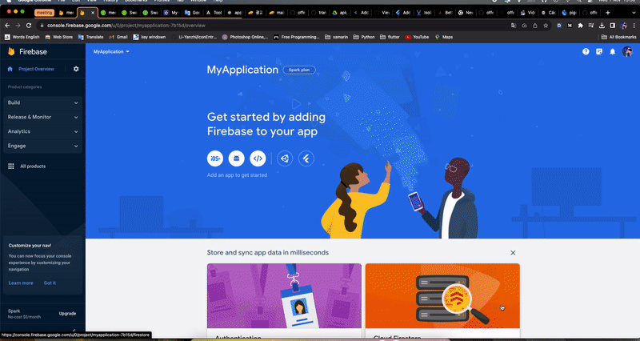

# Flutter OfferWall Module

This is a module for Android and iOS that can be used together, created based on the flutter framework

Prepared based on the following documents:

- [documentation android](https://docs.flutter.dev/add-to-app/android/project-setup?tab=with-android-studio).

- [documentation ios](https://docs.flutter.dev/add-to-app/ios/project-setup).

## Getting Started Version

WARNING: Please check if the version on your device is suitable, it may be equal or higher

### Flutter

- Flutter version 3.13.8 on channel stable
- Dart version 3.1.4
- DevTools version 2.25.0

### IOS

- Develop for iOS and macOS (Xcode 15.0)
- CocoaPods version 1.13.0


## Getting Started Import Module

- Project folder structure:

```
offerwall
├── docs
├── offerwall_module
│     ├── AndroidExample
│     ├── flutter_offerwall_module (Folder build sdk)
│     └── IOSExampleV2
└── offerwall_package (Folder source code module)

```

### IOS (SWIFT)

- [Project Example](https://github.com/Hongseungjin/offerwall/tree/dev_module/offerwall_module/IOSExampleV2).

### Create project ios swift


### Create project firebase

- Step 1: Open [Firebase console](https://console.firebase.google.com/u/0/)
- Step 2: Add project


- Step 3: Create app android



- Step 4: Add to the your project Android


- Step 5: Enable cloud messaging


### Build IOS Framework

- Open the terminal folder :  

```
offerwall
├── docs
├── offerwall_module
│     ├── AndroidExample
│     ├── flutter_offerwall_module (Folder build sdk)
│     └── IOSExampleV2
└── offerwall_package (Folder source code module)

```

- Example path folder build sdk:

```
cd <your path>/offerwal/offerwall_module/flutter_offerwall_module
```

- Command build IOS Framework:

NOTE: The built file can be copied to another project to import as an sdk

```
flutter build ios-framework --cocoapods --output=<your path>/<My Application>/Flutter 
```


### Add IOS framework to project

### Call IOS framework to project 
