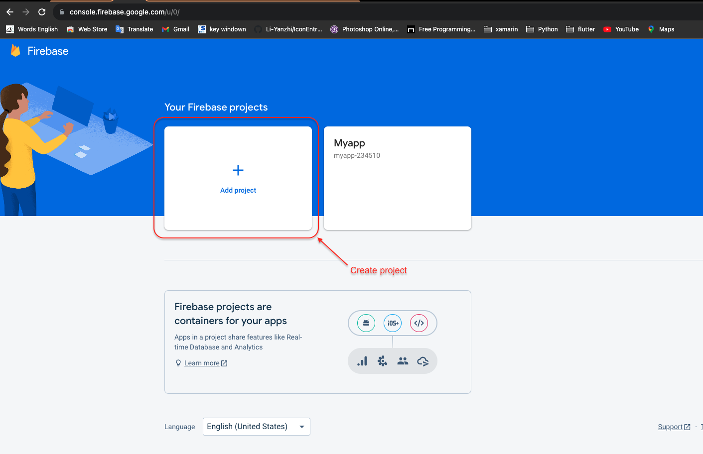
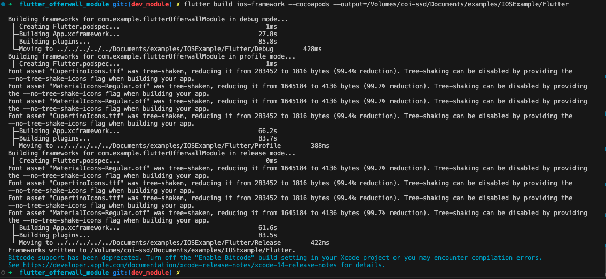
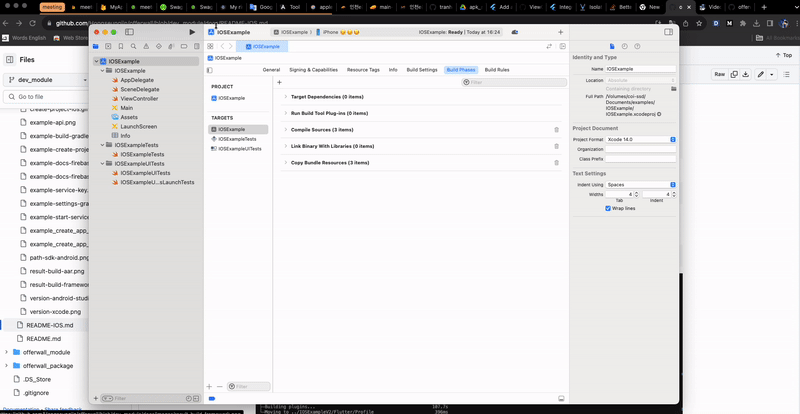
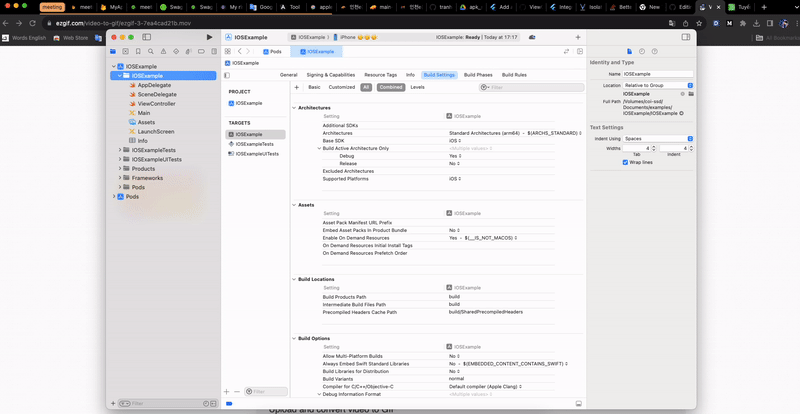

# Flutter OfferWall Module

This is a module for Android and iOS that can be used together, created based on the flutter framework

Prepared based on the following documents:

- [documentation android](https://docs.flutter.dev/add-to-app/android/project-setup?tab=with-android-studio).

- [documentation ios](https://docs.flutter.dev/add-to-app/ios/project-setup).

## Getting Started Version

WARNING: Please check if the version on your device is suitable, it may be equal or higher

### Flutter

- Flutter version 3.13.8 on channel stable
- Dart version 3.1.4
- DevTools version 2.25.0

### IOS

- Develop for iOS and macOS (Xcode 15.0)
- CocoaPods version 1.13.0


## Getting Started Import Module

- Project folder structure:

```
offerwall
├── docs
├── offerwall_module
│     ├── AndroidExample
│     ├── flutter_offerwall_module (Folder build sdk)
│     └── IOSExampleV2
└── offerwall_package (Folder source code module)

```

### IOS (SWIFT)

- [Project Example](https://github.com/Hongseungjin/offerwall/tree/dev_module/offerwall_module/IOSExampleV2).

### Create project ios swift


### Create project firebase

- Step 1: Open [Firebase console](https://console.firebase.google.com/u/0/)
- Step 2: Add project




- Step 3: Create app ios


- Step 4: Add to the your project IOS Xcode


- Step 5: Enable cloud messaging


### Build IOS Framework

- Open the terminal folder :  

```
offerwall
├── docs
├── offerwall_module
│     ├── AndroidExample
│     ├── flutter_offerwall_module (Folder build sdk)
│     └── IOSExampleV2
└── offerwall_package (Folder source code module)

```

- Example path folder build sdk:

```
cd <your path>/offerwal/offerwall_module/flutter_offerwall_module
```

- Command build IOS Framework:

NOTE: The built file can be copied to another project to import as an sdk

```
flutter build ios-framework --cocoapods --output=<your path>/<My Application>/Flutter 
```



```
<your path>/<My Application>/
└── Flutter/
    ├── Debug/
    │   ├── Flutter.podspec
    │   ├── App.xcframework
    │   ├── FlutterPluginRegistrant.xcframework
    │   └── example_plugin.xcframework (each plugin with iOS platform code is a separate framework)
    ├── Profile/
    │   ├── Flutter.podspec
    │   ├── App.xcframework
    │   ├── FlutterPluginRegistrant.xcframework
    │   └── example_plugin.xcframework
    └── Release/
        ├── Flutter.podspec
        ├── App.xcframework
        ├── FlutterPluginRegistrant.xcframework
        └── example_plugin.xcframework
```

### Add IOS framework to project

- Config search path framework in `Build Settings`:

```
$(inherited)
"${PODS_CONFIGURATION_BUILD_DIR}/FlutterPluginRegistrant"
"$(PROJECT_DIR)/Flutter/Release/"
```


- Add Framework in `Build Phases`:



- Host apps using CocoaPods can add Flutter to their `Podfile`:

```
pod 'Flutter', :podspec => './Flutter/Debug/Flutter.podspec'

target 'IOSExample' do
...
end

post_install do |installer|
  flutter_post_install(installer) if defined?(flutter_post_install)
  # installer.pods_project.build_configurations.each do |config|
  #   config.build_settings["EXCLUDED_ARCHS[sdk=iphonesimulator*]"] = "i386, arm64"
  # end
end

```

- Run `Podfile`:

```
pod install --repo-update
```

- Add config permission `Info.plist`:

```
 <key>NSBonjourServices</key>
 <array>
  <string>_dartobservatory._tcp</string>
 </array>

    ...

 <key>UIBackgroundModes</key>
 <array>
  <string>fetch</string>
  <string>processing</string>
  <string>remote-notification</string>
 </array>
 <key>NSLocationAlwaysUsageDescription</key>
 <string>This app needs access to location when in the background.</string>
 <key>NSCameraUsageDescription</key>
 <string>Allows access camera to take photo.</string>
 <key>NSPhotoLibraryUsageDescription</key>
 <string>Allows access camera to take photo.</string>
 <key>NSUserTrackingUsageDescription</key>
 <string>앱 추적 동의 팝업 창에 노출됩니다.</string>
 <key>UIApplicationSupportsIndirectInputEvents</key>
 <true/>
```

- Add file `api` object-c: [Link download file api](./files/).



### Call IOS framework to project

- Add config SDK to the `AppDelegate`

```

import UIKit
import FirebaseCore
import flutter_local_notifications
import FlutterPluginRegistrant
import Flutter

@main
class AppDelegate: UIResponder, UIApplicationDelegate {
    
    public var flutterEngine:FlutterEngine!
    
    func application(_ application: UIApplication, didFinishLaunchingWithOptions launchOptions: [UIApplication.LaunchOptionsKey: Any]?) -> Bool {
        // Override point for customization after application launch.

        ...
        
        //Start Config SDK OfferWall
        //Firebase config
        FirebaseApp.configure() 

        //Notification config
        FlutterLocalNotificationsPlugin.setPluginRegistrantCallback { (registry) in
            GeneratedPluginRegistrant.register(with: registry)
        }
        if #available(iOS 10.0, *) {
            UNUserNotificationCenter.current().delegate = self as? UNUserNotificationCenterDelegate
        }

        //Config FlutterEngine 
        let flutterDependencies = FlutterDependencies()        
        flutterEngine=flutterDependencies.flutterEngine
        //End Config SDK OfferWall

        ...
        
        return true
    }
    
}
...
//Config flutter
class FlutterDependencies: ObservableObject {
    let flutterEngine = FlutterEngine(name: "Offerwall")
    init(){
        // Runs the default Dart entrypoint with a default Flutter route.
//        flutterEngine.run()
        flutterEngine.run(withEntrypoint: nil)
        // Connects plugins with iOS platform code to this app.
        GeneratedPluginRegistrant.register(with: self.flutterEngine);
    }
}

```

- Call View OfferWall SDK

```
        let dataParam: BKBook = BKBook.init()
        dataParam.memBirth="2000-01-01"
        dataParam.memGen="w"
        dataParam.memRegion="인천_서"
        dataParam.memId="abee997"
        dataParam.firebaseKey="AAAArCrKtcY:APA91bHDmRlnGIMV9TUWHBgdx_cW59irrr6GssIkX45DUSHiTXcfHV3b0MynCOxwUdm6VTTxhp7lz3dIqAbi0SnoUFnkXlK-0ncZMX-3a3oWV8ywqaEm9A9aGnX-k50SI19hzqOgprRp"
        
        api.displayBookDetailsBook(dataParam) { (error) in
            if let error = error {
                print(error)
            }
        }
        let appDelegate = UIApplication.shared.delegate as! AppDelegate
        let flutterViewController = FlutterViewController(engine: appDelegate.flutterEngine, nibName: nil, bundle: nil)
        flutterViewController.modalPresentationStyle = .overCurrentContext
        self.present(flutterViewController, animated: true)

```

Note: Value of `data.firebaseKey`:


