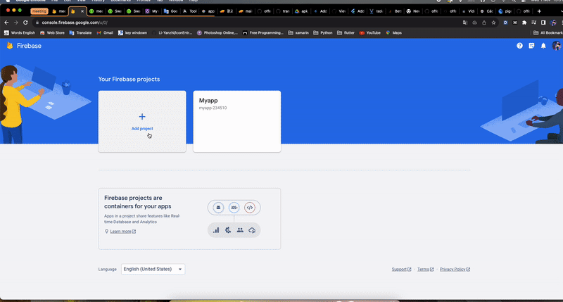
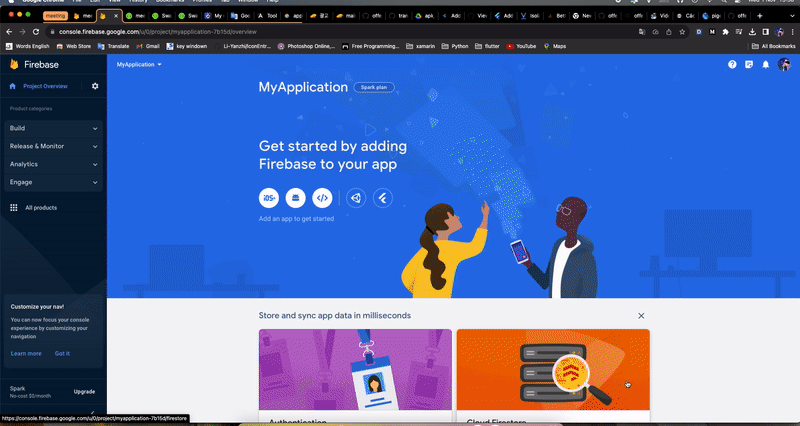
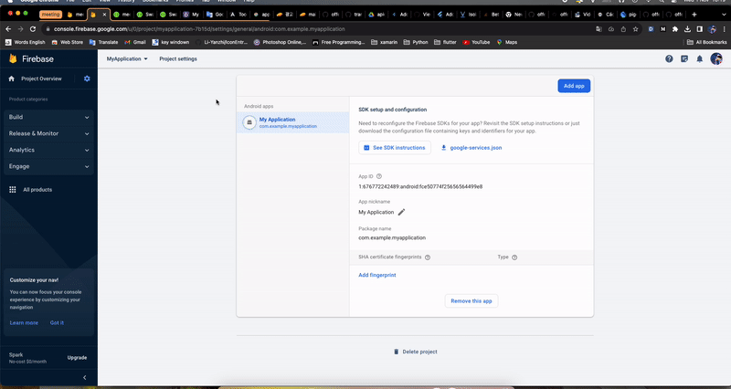

# Flutter OfferWall Module

This is a module for Android and iOS that can be used together, created based on the flutter framework

Prepared based on the following documents:

- [documentation android](https://docs.flutter.dev/add-to-app/android/project-setup?tab=with-android-studio).

- [documentation ios](https://docs.flutter.dev/add-to-app/ios/project-setup).

## Getting Started Version

WARNING: Please check if the version on your device is suitable, it may be equal or higher

### Flutter

- Flutter version 3.13.8 on channel stable
- Dart version 3.1.4
- DevTools version 2.25.0

### Android

- Android studio version: (Android SDK version 34.0.0)
- Java version OpenJDK Runtime Environment (build 11.0.15+0-b2043.56-8887301)


### IOS

- Develop for iOS and macOS (Xcode 15.0)
- CocoaPods version 1.13.0


## Getting Started Import Module

- Project folder structure:

```
offerwall
├── docs
├── offerwall_module
│     ├── AndroidExample
│     ├── flutter_offerwall_module (Folder build sdk)
│     └── IOSExampleV2
└── offerwall_package (Folder source code module)

```

### ANDROID (KOTLIN)

- [Project Example](https://github.com/Hongseungjin/offerwall/tree/dev_module/offerwall_module/AndroidExample).

### Create project android kotlin


### Create project firebase

- Step 1: Open [Firebase console](https://console.firebase.google.com/u/0/)
- Step 2: Add project




- Step 3: Create app android



- Step 4: Add to the your project Android


- Step 5: Enable cloud messaging



### Build sdk aar

- Open the terminal folder :  

```
offerwall
├── docs
├── offerwall_module
│     ├── AndroidExample
│     ├── flutter_offerwall_module (Folder build sdk)
│     └── IOSExampleV2
└── offerwall_package (Folder source code module)

```

- Example path folder build sdk:

```
cd <your path>/offerwal/offerwall_module/flutter_offerwall_module
```

- Command build sdk:

NOTE: The built file can be copied to another project to import as an sdk

```
flutter build aar --output=<your path>/<My Application>/app/libs
```


- Consuming the Module:

```
1. Open <host>/app/build.gradle
  1. Ensure you have the repositories configured 'settings.gradle' , otherwise add them:

      String storageUrl = System.env.FLUTTER_STORAGE_BASE_URL ?: "https://storage.googleapis.com"
      repositories {
        maven {
            url '<your path>/<My Application>/app/libs/host/outputs/repo'
        }
        maven {
            url "$storageUrl/download.flutter.io"
        }
      }

  2. Make the host app depend on the Flutter module:

    dependencies {
      debugImplementation 'com.example.flutter_offerwall_module:flutter_debug:1.0'
      profileImplementation 'com.example.flutter_offerwall_module:flutter_profile:1.0'
      releaseImplementation 'com.example.flutter_offerwall_module:flutter_release:1.0'
    }


  4. Add the `profile` build type:

    android {
      buildTypes {
        profile {
          initWith debug
        }
      }
    }
```

### Add sdk to project (Kotlin)

- Add config the `settings.gradle`:


- Add config the `profile` build type:


- Add file `Api.java`:

```
package <Your packageName>;

import java.io.ByteArrayOutputStream;
import java.nio.ByteBuffer;
import java.util.ArrayList;
import java.util.Arrays;
import java.util.HashMap;
import java.util.Map;

import io.flutter.plugin.common.BasicMessageChannel;
import io.flutter.plugin.common.BinaryMessenger;
import io.flutter.plugin.common.MessageCodec;
import io.flutter.plugin.common.StandardMessageCodec;

public class  Api{
    public static class OfferWall {
        //  memId: "abee997", memGen: "w", memBirth: "2000-01-01", memRegion: "인천_서"

        public String getMemId() {
            return memId;
        }

        public void setMemId(String memId) {
            this.memId = memId;
        }

        public String getMemGen() {
            return memGen;
        }

        public void setMemGen(String memGen) {
            this.memGen = memGen;
        }

        public String getMemBirth() {
            return memBirth;
        }

        public void setMemBirth(String memBirth) {
            this.memBirth = memBirth;
        }

        public String getMemRegion() {
            return memRegion;
        }

        public void setMemRegion(String memRegion) {
            this.memRegion = memRegion;
        }
        public String getFirebaseKey() {
            return firebaseKey;
        }

        public void setFirebaseKey(String firebaseKey) {
            this.firebaseKey = firebaseKey;
        }
        private String memId;
        private String memGen;
        private String memBirth;
        private String memRegion;
        private String firebaseKey;

        Map<String, Object> toMap() {
            Map<String, Object> toMapResult = new HashMap<>();
            toMapResult.put("memId", getMemId());
            toMapResult.put("memGen", getMemGen());
            toMapResult.put("memBirth", getMemBirth());
            toMapResult.put("memRegion", getMemRegion());
            toMapResult.put("firebaseKey", getFirebaseKey());

            return toMapResult;
        }
        static OfferWall fromMap(Map<String, Object> map) {
            OfferWall fromMapResult = new OfferWall();
            fromMapResult.memId = (String)map.get("memId");
            fromMapResult.memGen = (String)map.get("memGen");
            fromMapResult.memBirth = (String)map.get("memBirth");
            fromMapResult.memRegion = (String)map.get("memRegion");
            fromMapResult.firebaseKey = (String)map.get("firebaseKey");
            return fromMapResult;
        }
    }

    private static class HostOfferWallApiCodec extends StandardMessageCodec {
        public static final HostOfferWallApiCodec INSTANCE = new HostOfferWallApiCodec();
        private HostOfferWallApiCodec() {}
        @Override
        protected Object readValueOfType(byte type, ByteBuffer buffer) {
            switch (type) {
                case (byte)128:
                    return OfferWall.fromMap((Map<String, Object>)readValue(buffer));

                default:
                    return super.readValueOfType(type, buffer);
            }
        }
        @Override
        protected void writeValue(ByteArrayOutputStream stream, Object value) {
            if (value instanceof OfferWall) {
                stream.write(128);
                writeValue(stream, ((OfferWall)value).toMap());
            } else {
                super.writeValue(stream, value);
            }
        }
    }
    public interface HostOfferWallApi {
        void cancel();

        /** The codec used by HostOfferwallApi. */
        static MessageCodec<Object> getCodec() { return HostOfferWallApiCodec.INSTANCE; }

        /**
         * Sets up an instance of `HostOfferwallApi` to handle messages through the
         * `binaryMessenger`.
         */
        static void setup(BinaryMessenger binaryMessenger, HostOfferWallApi api) {
            {
                BasicMessageChannel<Object> channel = new BasicMessageChannel<>(
                        binaryMessenger, "dev.flutter.pigeon.HostOfferWallApi.cancel",
                        getCodec());
                if (api != null) {
                    channel.setMessageHandler((message, reply) -> {
                        Map<String, Object> wrapped = new HashMap<>();
                        try {
                            api.cancel();
                            wrapped.put("result", null);
                        } catch (Error | RuntimeException exception) {
                            wrapped.put("error", wrapError(exception));
                        }
                        reply.reply(wrapped);
                    });
                } else {
                    channel.setMessageHandler(null);
                }
            }
        }
    }


    public static class FlutterOfferWallApi {
        private final BinaryMessenger binaryMessenger;
        public FlutterOfferWallApi(BinaryMessenger argBinaryMessenger) {
            this.binaryMessenger = argBinaryMessenger;
        }
        public interface Reply<T> {
            void reply(T reply);
        }
        static MessageCodec<Object> getCodec() {
            return FlutterOfferWallApiCodec.INSTANCE;
        }

        public void displayOfferWallDetails(OfferWall bookArg, Reply<Void> callback) {
            BasicMessageChannel<Object> channel = new BasicMessageChannel<>(
                    binaryMessenger,
                    "dev.flutter.pigeon.FlutterOfferWallApi.displayOfferWallDetails", getCodec());
            channel.send(new ArrayList<Object>(Arrays.asList(bookArg)),
                    channelReply -> { callback.reply(null); });
        }
    }
    private static class FlutterOfferWallApiCodec extends StandardMessageCodec {
        public static final FlutterOfferWallApiCodec INSTANCE =
                new FlutterOfferWallApiCodec();
        private FlutterOfferWallApiCodec() {}
        @Override
        protected Object readValueOfType(byte type, ByteBuffer buffer) {
            switch (type) {
                case (byte)128:
                    return OfferWall.fromMap((Map<String, Object>)readValue(buffer));

                default:
                    return super.readValueOfType(type, buffer);
            }
        }
        @Override
        protected void writeValue(ByteArrayOutputStream stream, Object value) {
            if (value instanceof OfferWall) {
                stream.write(128);
                writeValue(stream, ((OfferWall)value).toMap());
            } else {
                super.writeValue(stream, value);
            }
        }
    }

    private static Map<String, Object> wrapError(Throwable exception) {
        Map<String, Object> errorMap = new HashMap<>();
        errorMap.put("message", exception.toString());
        errorMap.put("code", exception.getClass().getSimpleName());
        errorMap.put("details", null);
        return errorMap;
    }
}
```


- Create file `MyFlutterActivity`:

```
package <Your package>

import android.app.Activity
import android.content.Context
import android.content.Intent
import io.flutter.embedding.android.FlutterActivity
import io.flutter.embedding.engine.FlutterEngine

class MyFlutterActivity : FlutterActivity(){
    companion object {
        const val EXTRA_BOOK = "offerWall"
        fun withOfferWall(context: Context, offerWall: Api.OfferWall): Intent {
            return CachedEngineBookIntentBuilder(MyFlutterApplication.ENGINE_ID)
                .build(context) .putExtra(
                    EXTRA_BOOK,
                    HashMap(offerWall.toMap())
                )
        }
    }
    class CachedEngineBookIntentBuilder(engineId: String): CachedEngineIntentBuilder(MyFlutterActivity::class.java, engineId) { }

    override fun configureFlutterEngine(flutterEngine: FlutterEngine) {
        // Called shortly after the activity is created, when the activity is bound to a
        // FlutterEngine responsible for rendering the Flutter activity's content.
        super.configureFlutterEngine(flutterEngine)

        // Register the HostBookApiHandler callback class to get results from Flutter.
        Api.HostOfferWallApi.setup(flutterEngine.dartExecutor, HostOfferWallApiHandler())

        // The book to give to Flutter is passed in from the MainActivity via this activity's
        // source intent getter. The intent contains the book serialized as on extra.
        val bookToShow = Api.OfferWall.fromMap(intent.getSerializableExtra(EXTRA_BOOK) as HashMap<String, Any>)
        // Send in the book instance to Flutter.
        Api.FlutterOfferWallApi(flutterEngine.dartExecutor).displayOfferWallDetails(bookToShow) {
            // We don't care about the callback
        }
    }

    inner class HostOfferWallApiHandler: Api.HostOfferWallApi {
        override fun cancel() {
            // Flutter called cancel. Finish the activity with a cancel result.
            setResult(Activity.RESULT_CANCELED)
            finish()
        }
    }
}
```

- Add `MyFlutterActivity` and FlutterActivity to the `AndroidManifest.xml`

```
<application
...
>
        ...
        <activity
            android:name=".MyFlutterActivity"
            android:configChanges="orientation|keyboardHidden|keyboard|screenSize|locale|layoutDirection|fontScale|screenLayout|density|uiMode"
            android:hardwareAccelerated="true"
            android:windowSoftInputMode="adjustResize" />
        <activity
            android:name="io.flutter.embedding.android.FlutterActivity"
            android:theme="@style/Theme.AndroidExample.NoActionBar"
            android:configChanges="orientation|keyboardHidden|keyboard|screenSize|locale|layoutDirection|fontScale|screenLayout|density|uiMode"
            android:hardwareAccelerated="true"
            android:windowSoftInputMode="adjustResize"
            />
        ...
</application>
```

- Create `MyFlutterApplication`:

```
package <Your packageName>

import android.app.Application
import io.flutter.embedding.engine.FlutterEngine
import io.flutter.embedding.engine.FlutterEngineCache
import io.flutter.embedding.engine.dart.DartExecutor


class MyFlutterApplication : Application() {
    companion object {
        const val ENGINE_ID = "offerwall_engine"
    }
    private lateinit var flutterEngine: FlutterEngine
    override fun onCreate() {
        super.onCreate()
        // This application reuses a single FlutterEngine instance throughout.
        // Create the FlutterEngine on application start.
        flutterEngine = FlutterEngine(this).apply{
            dartExecutor.executeDartEntrypoint(DartExecutor.DartEntrypoint.createDefault())
        }

        FlutterEngineCache.getInstance().put(ENGINE_ID, flutterEngine)

    }

}

```

- Add `MyFlutterApplication` to the `AndroidManifest.xml`:

```
 <application
     android:name=".MyFlutterApplication"
     ...
     >
</application>
```

### Call sdk to project (Kotlin)

- Call Activity SDK

```
        var data: Api.OfferWall = Api.OfferWall()
            data.memId= "abee997"
            data.memGen= "w"
            data.memBirth= "2000-01-01"
            data.memRegion= "인천_서"
            data.firebaseKey= "<Your Service Key>"
            startActivityForResult(
                MyFlutterActivity
                    .withOfferWall(requireContext(), data),
                0)
```

Note: Value of `data.firebaseKey`:


- Handle result Activity:

```
 override fun onActivityResult(requestCode: Int, resultCode: Int, data: Intent?) {
        super.onActivityResult(requestCode, resultCode, data)

        // The Flutter activity may cancel the edit. If so, don't update anything.
        if (resultCode == Activity.RESULT_OK) {
            if (data == null) {
                throw RuntimeException("The FlutterBookActivity returning RESULT_OK should always have a return data intent")
            }
        }
    }
```
