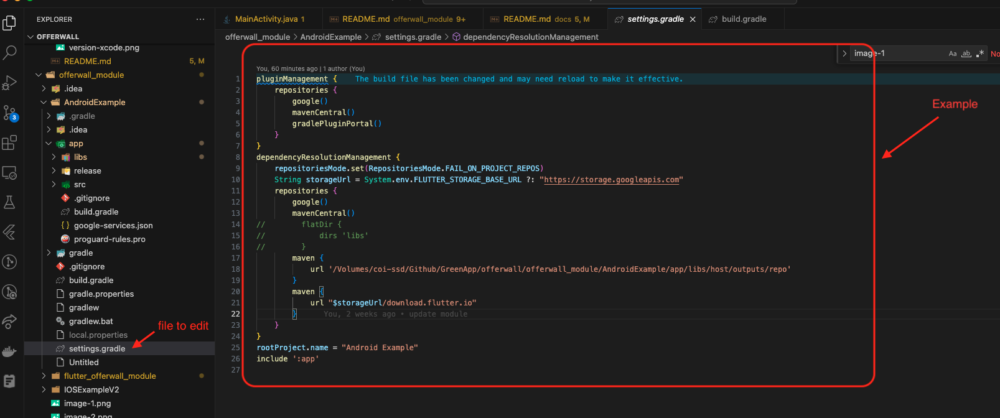

# Flutter OfferWall Module

This is a module for Android and iOS that can be used together, created based on the flutter framework

Prepared based on the following documents:

- [documentation android](https://docs.flutter.dev/add-to-app/android/project-setup?tab=with-android-studio).

- [documentation ios](https://docs.flutter.dev/add-to-app/ios/project-setup).

## Getting Started Version

WARNING: Please check if the version on your device is suitable, it may be equal or higher

### Flutter

- Flutter version 3.13.8 on channel stable
- Dart version 3.1.4
- DevTools version 2.25.0

### Android

- Android studio version: (Android SDK version 34.0.0)
- Java version OpenJDK Runtime Environment (build 11.0.15+0-b2043.56-8887301)


### IOS

- Develop for iOS and macOS (Xcode 15.0)
- CocoaPods version 1.13.0


## Getting Started Import Module

- Project folder structure:

```
offerwall
├── docs
├── offerwall_module
│     ├── AndroidExample
│     ├── flutter_offerwall_module (Folder build sdk)
│     └── IOSExampleV2
└── offerwall_package (Folder source code module)

```

### ANDROID

### Create project android kotlin


### Build sdk aar

- Open the terminal folder :  

```
offerwall
├── docs
├── offerwall_module
│     ├── AndroidExample
│     ├── flutter_offerwall_module (Folder build sdk)
│     └── IOSExampleV2
└── offerwall_package (Folder source code module)

```

- Example path folder build sdk:

```
cd <your path>/offerwal/offerwall_module/flutter_offerwall_module
```

- Command build sdk:

NOTE: The built file can be copied to another project to import as an sdk

```
flutter build aar --output=<your path>/<My Application>/app/libs
```


- Consuming the Module:

```
1. Open <host>/app/build.gradle
  1. Ensure you have the repositories configured 'settings.gradle' , otherwise add them:

      String storageUrl = System.env.FLUTTER_STORAGE_BASE_URL ?: "https://storage.googleapis.com"
      repositories {
        maven {
            url '<your path>/<My Application>/app/libs/host/outputs/repo'
        }
        maven {
            url "$storageUrl/download.flutter.io"
        }
      }

  2. Make the host app depend on the Flutter module:

    dependencies {
      debugImplementation 'com.example.flutter_offerwall_module:flutter_debug:1.0'
      profileImplementation 'com.example.flutter_offerwall_module:flutter_profile:1.0'
      releaseImplementation 'com.example.flutter_offerwall_module:flutter_release:1.0'
    }


  4. Add the `profile` build type:

    android {
      buildTypes {
        profile {
          initWith debug
        }
      }
    }
```

- Example the `settings.gradle`:



- Example the `profile` build type:


